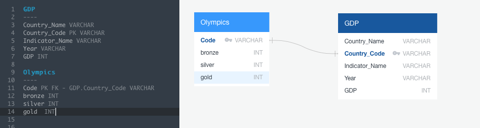
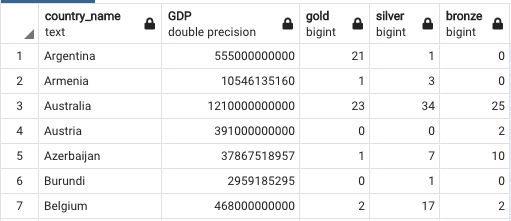

# ETL-Project
2016 Olympics Vs GDP

# Project Proposal

To compare GDP in 2016 with the Olympic medal winners 

# Finding Data

We used the below sources: 

[Data world ](https://data.world/nilanshuramteke/gdp-by-country/workspace/file?filename=GDP+By+Country.csv)

[Kaggle](https://www.kaggle.com/heesoo37/120-years-of-olympic-history-athletes-and-results)

# Data Cleanup & Analysis

Using pandas we cleaned up the data to only the columns we needed and exported into the SQL database 

# Project Report

We joined the two data cources in SQL on country code 

